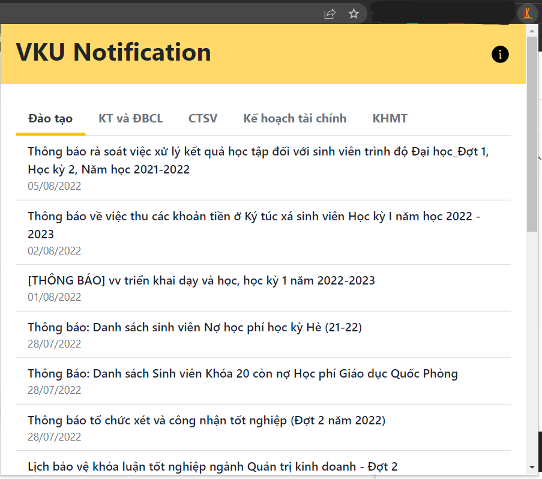

# VKU Notifications 👋

> Đây là extension được làm ra với mục địch giúp sinh viên VKU có thể xem thông báo từ các phòng đào tạo, công tác sinh viên,... một cách nhanh gọn, tự động nhận thông báo tới desktop để không bỏ lỡ mỗi khi có thông báo từ trường.

## Hướng dẫn

-   Tải extension [tại đây](https://github.com/hoangtrung1801/vku-notification/releases/tag/v0.2)
-   Giải nén file
-   Truy câp vào [chrome://extensions](chrome://extension), bật "developer mode"
-   Kéo thả folder vừa được giải nén vào đó.

→ Vậy là bạn đã thành công cài đặt extension.

[Hướng dẫn chi tiết](https://docs.google.com/document/d/1O2BxHBuod0sSGjswPo-0QCYIfZsZBVcIar_7K4bwYVs/edit?usp=sharing)

[Tải extension](https://github.com/hoangtrung1801/vku-notification/releases/tag/v0.2)

## Lưu ý

-   Hiện tại không thể public thông qua Google Web Store vì nó yêu cầu phí, nên mọi người có thể tải extension [tại đây](https://github.com/hoangtrung1801/vku-notification/releases/tag/v0.2).
-   Vì extension hiện tại đang phiên bản 1.0, nên sẽ có nhiều sai sót, trục trặc trong quá trình dùng. Nên nếu gặp vấn đề gì, vui lòng liên hệ với mình qua email hoangtrung1801.2003@gmail.com.

## Một số hình ảnh

→ Popup

→ Icon extension trên thanh bar chrome

→ Thông báo

## Author

👤 **hoangtrung1801**

-   Github: [@hoangtrung1801](https://github.com/hoangtrung1801)

---
